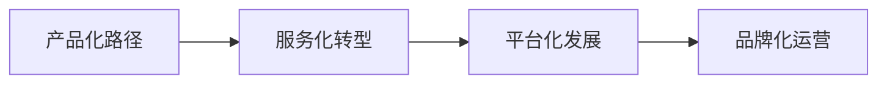

# 米遇安：连接创意与未来的创新力量

## 一、品牌概述与核心理念

### 1.1 品牌由来与愿景

**米遇安**，这个名字承载着一个年轻团队对未来的无限憧憬与坚定信念。作为一支诞生于创新沃土的团队，米遇安以“做大做强，兴创辉煌”为核心理念，致力于用创意与代码连接现实与未来，打造有温度的智能工具、有深度的互动体验。

米遇安不仅仅是一个品牌，更是一个汇聚了智慧与创新激情的平台。自2025年11月1日团队正式建立以来，这支由五位元老成员组成的初创团队，怀揣着对技术与创造的热情，开启了这段充满挑战与机遇的创业之旅。

米遇安的愿景是成为连接创意与未来的一座桥梁，让每一位用户都能享受到科技带来的便利与乐趣。

### 1.2 核心价值主张

米遇安的价值主张可以概括为三个关键词：**实用工具、有趣游戏、教育文化**。这三个维度构成了米遇安产品生态的核心支柱。

| 维度 | 核心定位 | 代表产品 |
|:---:|:---|:---|
| 🛠️ **实用工具** | 高效便捷，提升效率 | 米遇安新闻、米遇安搜索 |
| 🎮 **有趣游戏** | 策略思维，团队协作 | 现代战争推演系列 |
| 📚 **教育文化** | 启迪智慧，传承文化 | 米遇安文化 |

**实用工具** —— 在信息爆炸的时代，高效的信息获取与处理能力至关重要。米遇安开发了一系列实用工具，从新闻资讯平台到智能搜索功能，致力于帮助用户在信息海洋中快速找到所需内容，提升学习与工作效率。

**有趣游戏** —— 游戏不仅是娱乐，更是思维训练与团队协作的绝佳载体。米遇安的游戏分区以“现代战争推演”系列为代表，将战术思维、策略规划与娱乐体验相结合，让玩家在游戏中锻炼决策能力与团队协作精神。

**教育文化** —— 文化是民族精神的命脉，教育是文明传承的基石。米遇安教育分区专注于传播优秀的教育理念与文化内容，融合传统智慧与现代科技，为学习者提供有深度、有温度的学习资源。

### 1.3 团队精神与组织文化

米遇安团队虽然年轻，但已经形成了独特而鲜明的组织文化。五位元老成员各司其职，分工明确：

| 成员 | 职位 | 核心职责 |
|:---:|:---|:---|
| **凤峰** | 团长 / 产品架构师 | 整体战略规划与产品设计 |
| **陈思齐** | 测试 / 质量保障 | 产品质量把控与测试 |
| **孙语宸** | 产品运营 | 日常运营与用户体验优化 |
| **蒋筳瀚** | 内容策划 | 创意与深度内容注入 |
| **莫子妍** | 社区运营 | 用户沟通与社群建设 |

这种扁平化的组织结构，确保了团队能够快速响应市场变化与用户需求，同时也为每位成员提供了充分发挥才能的空间。

团队文化强调四大核心原则：

> **开放** —— 欢迎外部意见与建议，构建开放生态
>
> **协作** —— 团队内部的紧密配合，协同共赢
>
> **创新** —— 团队发展的核心驱动力，持续突破
>
> **务实** —— 确保每一项工作都能落地执行，追求实效

---

## 二、发展历程与重要里程碑

### 2.1 初创期：从零到一的突破

**2025年11月1日**，团队正式建立。五位志同道合的年轻人走到一起，怀揣着共同的理想与热情，开启了这段创新之旅。初创团队的成立并非偶然，而是源于对诸多现实痛点的观察与思考，激发了这群年轻人改变现状的决心。

**2025年11月2日**，团队确定了品牌标识，这一决策体现了团队的国际化视野与品牌意识。一个清晰的品牌标识，不仅是团队身份的象征，更是对外传递价值观的重要载体。

### 2.2 产品开发与迭代

**2025年12月1日**，团队发布了首款产品预览版。这款产品的诞生，源于对信息管理痛点的深刻洞察。通过数字化手段，大大简化了信息管理流程，为用户提供了便捷的工具。

**2025年12月29日**，团队正式建立社群，这一举措标志着团队开始构建自己的用户社群。社群不仅是用户反馈的重要渠道，更是团队与用户之间建立情感连接的桥梁。

**2025年12月30日**，团队确定了首批预览体验成员，这些早期用户在产品打磨过程中提供了宝贵的意见与建议。

### 2.3 正式发布与团队扩张

**2026年1月9日**，经过反复测试与优化，首款产品正式发布。这是米遇安团队的重要里程碑，标志着团队从产品开发阶段正式进入产品运营阶段。正式版的发布获得了积极的反响，用户对产品的便捷性与实用性给予了高度评价。

**2026年1月20日**，团队召开了第一次代表大会。这次会议具有历史性意义——团队正式确立了核心口号：

> # 做大做强 兴创辉煌

这八个字不仅是对团队愿景的精炼表达，更是激励每一位团队成员不断前行的精神旗帜。

**2026年2月3日**，团队发出了第一份招聘预稿，这标志着团队开始从五人小团队向更大规模的组织迈进。招聘不仅是为了扩大团队规模，更是为了引入多元化的专业能力，为未来的产品创新奠定人才基础。

**2026年2月7日**，第二次代表大会召开，会议进一步完善了团队的组织架构。明确的职责分工与决策机制，为团队的稳健发展提供了制度保障。

### 2.4 战略确立与官网发布

**2026年3月11日**，第三次代表大会召开，这是米遇安发展史上最重要的一次战略会议。会议明确了团队的三大主要发展方向：

- 🔧 **工具分区**
- 🎮 **游戏分区**
- 📖 **教育分区**

这一战略决策，为米遇安的未来发展指明了清晰的路径。同一天，米遇安官方网站正式发布，官网不仅展示了团队的核心产品与最新动态，更成为用户了解米遇安、与米遇安互动的重要窗口。

**2026年3月28日**，团队第一次集体会议成功召开并圆满结束。这次会议确立了未来发展方向与团队协作机制，标志着团队从初创期正式进入成长期，为未来的产品创新与市场拓展奠定了坚实基础。

---

## 三、产品体系与创新亮点

### 3.1 工具分区：实用至上

工具分区以“**实用、高效、便捷**”为设计理念，致力于为用户提供真正有用的工具产品。

#### 📰 米遇安新闻

一个聚焦时事热点、传递新鲜资讯的新闻平台。与传统的新闻媒体不同，米遇安新闻更加关注与用户生活密切相关的内容，从科技前沿到文化热点，为用户提供全方位的信息服务。新闻平台的设计充分考虑了用户的使用习惯：

- 界面简洁明了，内容分类清晰
- 用户可以快速找到自己感兴趣的内容
- 支持多端访问，随时随地获取资讯

#### 🔍 米遇安搜索

一个快速搜索全网信息的智能搜索工具。在信息爆炸的时代，如何快速准确地找到所需信息成为一大挑战。米遇安搜索通过优化的搜索算法与友好的用户界面，为用户提供了高效的信息检索体验：

- 输入关键词即可快速获取相关搜索结果
- 智能联想与推荐，提升搜索效率
- 简洁无干扰的搜索界面

工具分区的设计理念体现了米遇安“**以用户为中心**”的产品思维。每一个工具产品都源于对用户实际需求的深入洞察，在功能设计上追求简洁高效，在用户体验上追求流畅自然。

---

### 3.2 游戏分区：策略与娱乐的完美结合

游戏分区以“**现代战争推演**”系列为代表，将策略思维训练与娱乐体验有机结合。

#### 🎯 现代战争推演系列

这是一个以现代战争为背景的策略游戏系列。与传统射击类游戏不同，现代战争推演更加注重玩家的**策略规划**与**决策能力**。玩家需要在复杂的战场环境中：

- 合理调配资源
- 制定战术策略
- 协调团队配合

这种设计不仅提供了娱乐体验，更在潜移默化中培养了玩家的系统思维与团队协作能力。

| 作品 | 状态 | 特点 |
|:---:|:---:|:---|
| 现代战争推演1 | 线下参与 | 系列开山之作，奠定核心玩法 |
| 现代战争推演2 | 在线试玩 | 增加战术元素与互动功能 |
| 现代战争推演3 | 研发中 | 更加丰富的游戏体验 |
| 现代冲突 | 线下参与 | 系列外传，探索不同机制 |

游戏分区的成功，证明了米遇安团队在产品创新方面的能力。游戏不仅是娱乐产品，更可以成为思维训练与能力培养的有效工具。

---

### 3.3 教育分区：文化与智慧的传承

教育分区以“**启迪智慧·传承文化**”为使命，致力于为学习者提供有深度、有温度的文化内容。

#### 📖 米遇安文化

一个专注于教育理念与文化传播的内容平台。米遇安文化融合传统智慧与现代科技，通过多元化的内容形式——从文章到视频，从线上课程到互动体验——为用户提供丰富的学习资源。

内容涵盖多个领域：

- 传统文化与现代解读
- 科技创新与应用
- 艺术欣赏与审美培养
- 思维训练与能力提升

教育分区的设计理念体现了米遇安对教育本质的深刻理解。教育不仅仅是知识的传授，更是思维方式的培养与价值观的塑造。因此，米遇安文化在内容设计上特别注重**启发性**和**互动性**，鼓励学习者主动思考、积极探索。

---

### 3.4 其他分区：多元化的服务拓展

除了三大核心分区，米遇安还设有“其他分区”，为用户提供更多元化的服务。

#### 👥 信息收集平台

这是米遇安推出的首款产品，经过多次迭代优化，已经成为功能完善的信息管理工具。产品支持信息的收集、整理、导出等多种功能，大大简化了信息管理的流程。

#### 💼 人才招募

随着团队规模的扩大，米遇安开始通过官网发布招聘信息，吸引更多优秀人才加入团队。招聘平台不仅展示了团队的发展历程与文化理念，更为有志于加入米遇安的伙伴提供了便捷的申请渠道。

#### 🚀 公测成员招募

米遇安重视用户反馈在产品迭代中的作用，因此设立了公测成员招募机制。通过这一机制，用户可以提前体验最新产品，并为产品优化提供宝贵意见。

---

## 四、技术架构与设计理念

### 4.1 前端技术栈

米遇安官网采用了现代化的前端技术栈，为用户提供流畅、美观的使用体验。

| 技术 | 用途 | 优势 |
|:---:|:---|:---|
| **Tailwind CSS** | 样式框架 | 原子化设计，高复用性与可维护性 |
| **Font Awesome** | 图标库 | 丰富多样的图标资源 |
| **响应式设计** | 多端适配 | 桌面/平板/移动端统一体验 |

### 4.2 视觉设计语言

米遇安的视觉设计语言可以概括为“**现代、清新、专业**”三个关键词。

#### 🎨 色彩系统

- **主色调**：蓝色系（#0078D7），象征科技、信任与深度
- **辅助色**：浅灰与深灰，用于区分信息层级
- **深色模式**：自动适配，确保任何环境下的舒适体验

#### 🔮 玻璃质感设计

米遇安官网采用了时下流行的玻璃质感设计（Glassmorphism）：

- 半透明背景营造通透感
- 模糊效果增强层次感
- 细腻边框提升精致度

#### ✨ 动效设计

在关键交互节点加入精心设计的动效：

- 按钮悬停反馈
- 卡片展开动画
- 轮播切换过渡
- 页面切换动效

#### ⬜ 直角设计语言

除圆形头像等特定元素外，几乎所有组件都采用直角设计。这种设计选择体现了团队“**干脆利落、不拖泥带水**”的做事风格，与品牌“务实”的价值观相呼应。

### 4.3 深色模式与用户偏好

米遇安官网实现了完整的深色模式支持：

- 用户可根据个人偏好或环境光线选择显示模式
- 系统自动检测并应用用户偏好设置
- 手动切换的选择会被保存，下次自动应用

### 4.4 性能优化

优秀的用户体验离不开流畅的性能表现：

| 优化策略 | 说明 |
|:---|:---|
| 图片优化 | 压缩处理，保证质量的同时减小体积 |
| 代码分割 | 按需加载，只加载当前页面所需资源 |
| 懒加载 | 非首屏内容延迟加载 |
| 动画性能 | 使用GPU加速属性，确保流畅不掉帧 |

---

## 五、用户社区与生态建设

### 5.1 社群运营策略

米遇安深知，一个产品的成功不仅仅取决于功能本身，更取决于围绕产品建立的用户社区。

**💬 社群平台** —— 作为最早的社群阵地，社群已经成为用户交流、反馈问题、获取资讯的重要平台。气氛活跃，团队成员会定期与用户互动，解答疑问、收集建议。

**🔬 公测成员计划** —— 邀请热心用户提前体验最新产品，并为产品优化提供意见。这种“共创”模式不仅提升了用户参与感，更让产品能够更好地满足用户需求。

**📝 用户反馈机制** —— 官网设有多种用户反馈渠道，用户可以通过多种方式提交意见与建议。团队会对每一条反馈进行认真评估，并将其纳入产品迭代计划。

### 5.2 开放生态与第三方合作

米遇安秉持开放的态度，欢迎第三方开发者与合作伙伴加入生态建设。

#### 🙏 特别鸣谢

米遇安官网设有“特别鸣谢”区域，公开感谢对团队发展提供支持的平台与个人：

- GitHub
- Microsoft
- ChatGPT
- DeepSeek
- 金山办公

#### 🤝 合作机会

米遇安官网开放合作通道，欢迎相关机构与个人洽谈合作。

---

## 六、未来规划与发展方向

### 6.1 产品路线图

基于第三次代表大会确立的战略方向，米遇安制定了清晰的产品路线图。

#### 📍 短期目标（2026年Q2-Q3）

- 完成“现代战争推演3”的开发与测试
- 拓展工具分区产品线，推出更多实用工具
- 优化官网性能与用户体验
- 扩大公测成员规模，建立更完善的用户反馈机制

#### 📍 中期目标（2026年Q4-2027年）

- 推出移动端App，提供更好的移动体验
- 建立更完善的用户账号体系
- 拓展教育分区内容，引入更多优质资源
- 探索AI技术在产品中的应用

#### 📍 长期目标（2027年以后）

- 打造完整的米遇安产品生态
- 拓展更广阔的市场
- 建立可持续发展的商业模式
- 成为创新领域的知名品牌

### 6.2 团队扩张计划

随着业务的拓展，米遇安计划在未来一年内扩充团队规模，引入更多专业人才：

| 方向 | 岗位需求 |
|:---|:---|
| 技术研发 | 前端开发、后端开发、游戏开发 |
| 产品设计 | UI设计、UX设计 |
| 内容运营 | 内容编辑、社区运营 |
| 市场拓展 | 商务合作、品牌推广 |

### 6.3 可持续发展战略

米遇安认识到，要实现长远发展，必须建立可持续的商业模式：

- **产品化路径** —— 将成功的项目产品化，形成可复制的解决方案
- **服务化转型** —— 在工具产品基础上，提供增值服务
- **平台化发展** —— 构建开放平台，吸引第三方开发者共建生态
- **品牌化运营** —— 通过品牌建设提升影响力，为商业化奠定基础

---

## 七、结语：梦想与创新的交响

米遇安的故事，是一个关于梦想与创新的故事。五位志同道合的年轻人，怀揣着对技术与创造的热忱，开始了这段充满挑战与机遇的创业之旅。

短短几个月的时间，米遇安从一个想法变成了现实：

- 从第一款产品的预览版，到如今拥有工具、游戏、教育三大分区的完整产品体系
- 从五人小团队，到如今拥有完善组织架构与明确战略规划的创新力量

这一路走来，有汗水也有欢笑，有挫折也有突破，但团队从未放弃对梦想的追求。

> **做大做强，兴创辉煌**

这不仅仅是一句口号，更是每一位米遇安成员心中的信念。未来，米遇安将继续秉持“开放、协作、创新、务实”的理念，用创意与代码连接现实与未来，打造有温度的智能工具、有深度的互动体验。

当创新的力量与梦想的激情相遇，必将迸发出璀璨的火花。米遇安的故事才刚刚开始，让我们共同期待，这支年轻的团队将在未来的画卷上，描绘出更加绚丽的色彩。

---

**米遇安 · 做大做强，兴创辉煌**

*用创意连接未来，用代码创造价值*

